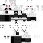

# 1. HTML : Введение

html - это язык гипертекстовой разметки (Hypertext marcup Language). описывает структуру и сематику web-страницы. Всё то что считываестя браузерами. Браузеры - движки обработки нашего кода (HTML+CSS+JS).

Приложения бывают двух видов: тонкий клиент (приложение мало весит оно завернуто на сервере организации. мы - клиенты подключаемся по протоколу HTTP/HTTPS) (заходим на сайт) По сути нам необходим лишь браузер и толстый клиент. (приложение много весит и устанавливается в оболочу ОС).
Примеры тонкого клиента : MS Teams (браузерная версия), Discord и тд
Примеры толстого клиента: СУБД 1С, Игры, Мобильные приложение.

HTML - каркас страницы (веб-приложения) в браузере. Состоит из тегов (элементов) = блочные и строчные элементы. Внутри элементов находится контент (текст, изображения, кнопки, списки, таблицы, формы).
Большинство тегов HTNL парные

Коментарий в HTML : <!--  -->

Примеры парных тегов

</head></head>
<body></body>
<header></header>
<main></main>
<footer>></footer>
<nav></nav>
<arcticle></arcticle>
<section></section>

Примеры непарных тегов
<meta>

1. Блочный элемент - контейнер, имеющий первйы тег и границы. Основные правила
Блочный элемент по умолчанию занимает всю ширину  экрана клиента. Блочные элементы раполагаются друг под другом.(если не вложены, а идут друг за другом в коде). Высота блочного элемента (по умолчанию) высчитывается по высоте содержимого контента внутри этого элемента

Основные Семантические тэги:
1) header - Секция для вводной информации сайта или группы навигационных ссылок. Может содержать один или несколько заголовков, логотип, информацию об авторе.

2) Main - Контейнер для основного уникального содержимого документа. На одной странице должно быть не более одного элемента <main>.

3) Footer - Определяет завершающую область (нижний колонтитул) документа или раздела.

4) Nav - Раздел документа, содержащий навигационные ссылки по сайту.

5) article - Раздел контента, который образует независимую часть документа или сайта, например, статья в журнале, запись в блоге, комментарий.

6) section - 	Определяет логическую область (раздел) страницы, обычно с заголовком.

7) aside - 	Представляет контент страницы, который имеет косвенное отношение к основному контенту страницы/сайта.

8) div - Элемент-контейнер для разделов HTML-документа. Используется для группировки блочных элементов с целью форматирования стилями.

Книга о тэгах: ''https://html5book.ru/html-html5/''

2.  Строчный элемент - элемент веб-страницы, который располагается внутри строки, не начинается с новой строки и занимает по ширине ровно столько места, сколько нужно для его содержимого

STRONG - Жирный текст

<strong>
</strong>

EM - курсивный текст
<em>
</em>

SMALL - Шрифт меньше чем другой
<small>
</small>

SPAN- g

MARK- Желтый шрифт сзади
<mark>
</mark>

BR- переонсит текст в низ
 
 

## ЗАГОЛОВКИ
<h1>-<h6>
</h1>-</h6>
!!!Эти теги семантически важные!!!
H1 - не более одного элемента на странице.

## ИЗОБРАЖЕНИЯ

 - Вставка внешного источника изображения

 - Локальная

FIGURE -  вставка
Самодостаточный элемент-контейнер для такого контента как иллюстрации, диаграммы, фотографии, примеры кода, обычно с подписью.

<figure>
<figcaption>	Заголовок/подпись для элемента<figure>.

## ГИПЕРССЫЛКИ

<a href="https://www.youtube.com/watch?v=aXHwEcNEc2A">YouTube</a> - Вставка внешней ссылки
<a href="./shop.html">Магазин</a> - Вставка внутреней ссылки

## СПИСКИ
# Маркированный список
<ul>
<li> Главная
</li>
</ul>

# Нумерованный списко
<ol>
      <li>Главная
      </li>
</ol>

# Таблица
Таблица используются очень часто в случаях когда передаются данные с сервера из баззы данных

<table>
     <caption>Название таблицы</caption> (Необязательно)
    <thead> - Первая строка ( Заголовки страницы)
    <tr> - Добавление строки
    <th>
    Название
    </th>
    <th>

    </th>
    <th>
    </th>
    </tr>
    </thead>
.
    <tbody>
    </tbody>

    <tfoot> - Необязателен
    </tfoot>

</table>

# Формы
FROM - Добавляет на страницу форму которую пользователь може заполнить например ввести своё имя фамилию или почтук ДаННЫЕ фОРМЫ ОТПРАВЛЯЮТСЯ НА СЕРВЕР
<Form action="./login.js">

<label>Логин</lobel>
<input>

<label>Пороль</lobel>
<input>

<button>Войти</button>

